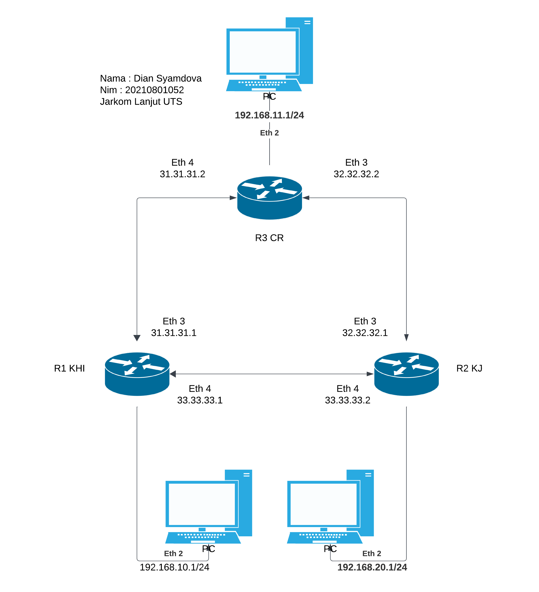

# Essay

## 1. Apa itu Routing Static?
Routing Static merupakan teknik mengatur rute jaringan secara manual di perangkat seperti router untuk mengarahkan data dari satu jaringan ke jaringan lain.

## 2. Apa itu Routing Dynamic?
Routing Dynamic merupakan teknik routing dalam jaringan komputer di mana rute atau jalur pengiriman data ditentukan dan diperbarui secara otomatis oleh router dengan menggunakan protokol routing dinamis.

## 3. Apa itu Firewall?
Firewall merupakan sistem keamanan penting dalam jaringan komputer yang melindungi jaringan dari akses yang tidak sah dan ancaman eksternal. Dengan memfilter dan memantau lalu lintas data, firewall membantu menjaga keamanan jaringan, mengontrol akses pengguna, serta mencegah penyebaran malware.

## 4. Apa itu NAT?
NAT merupakan teknologi yang memungkinkan perangkat dalam jaringan lokal berbagi alamat IP publik untuk mengakses jaringan eksternal, seperti internet.

# Cased

